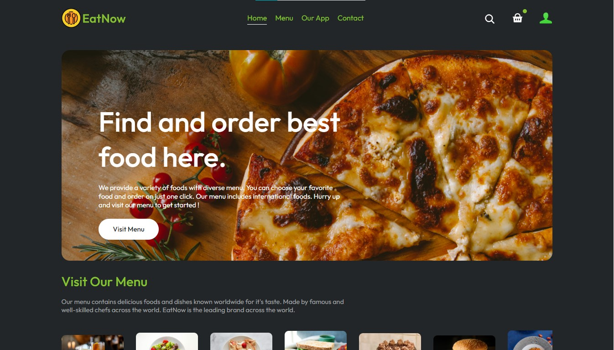
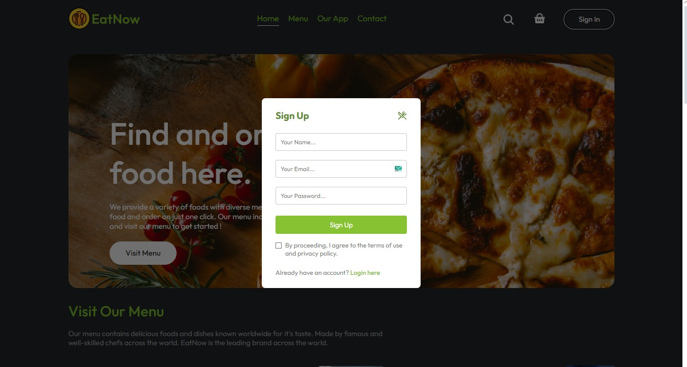
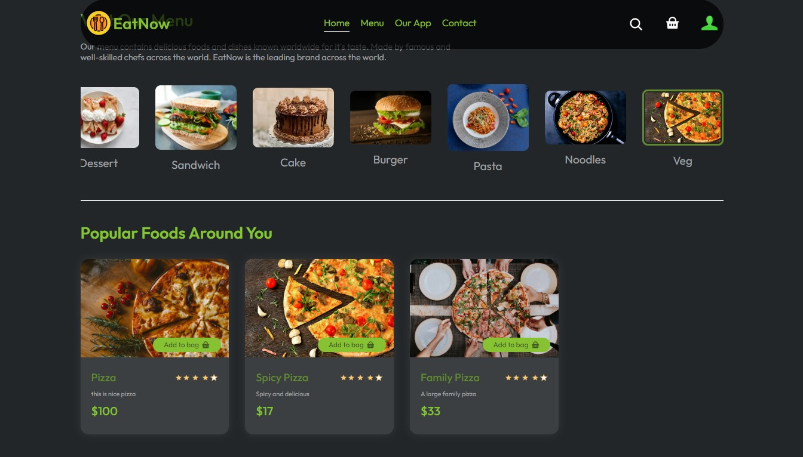
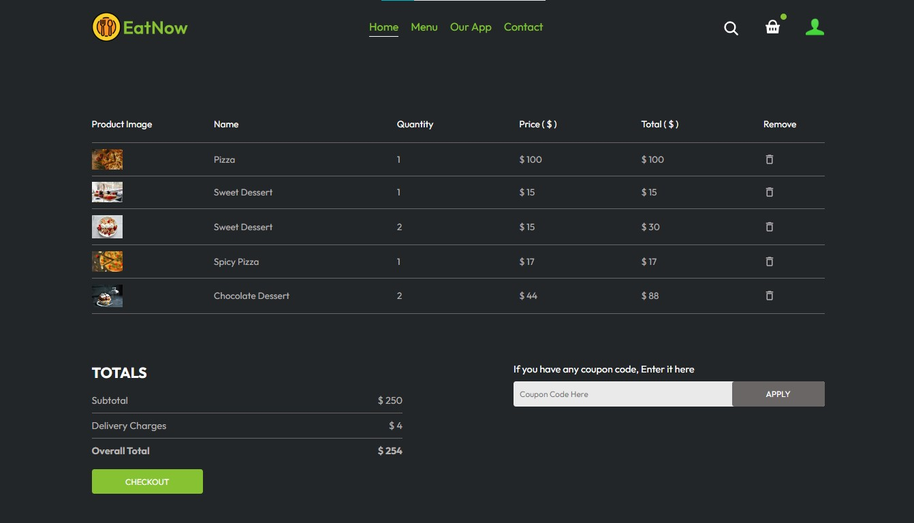
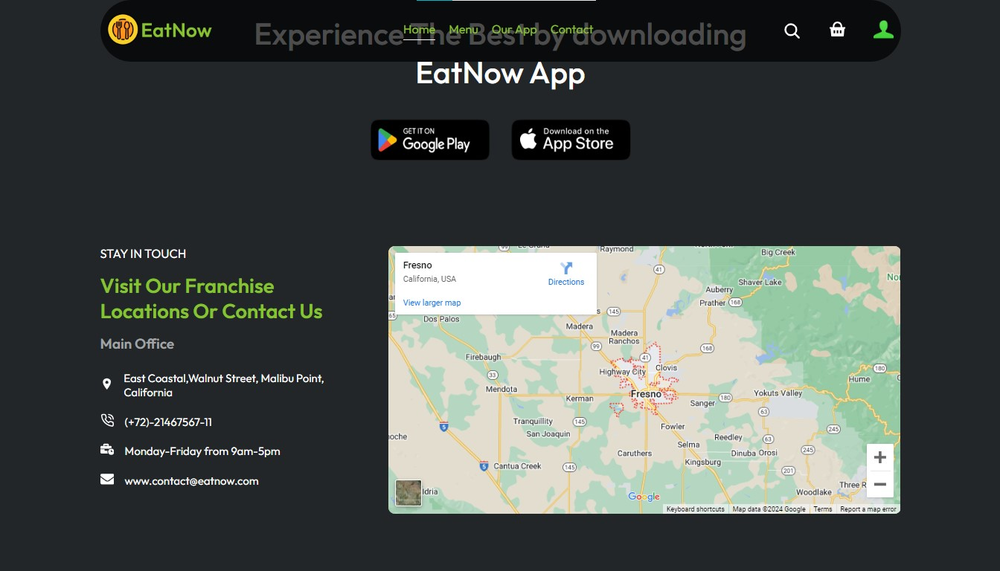
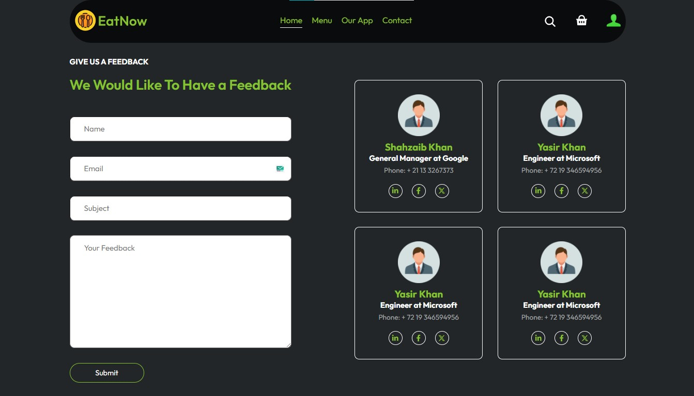
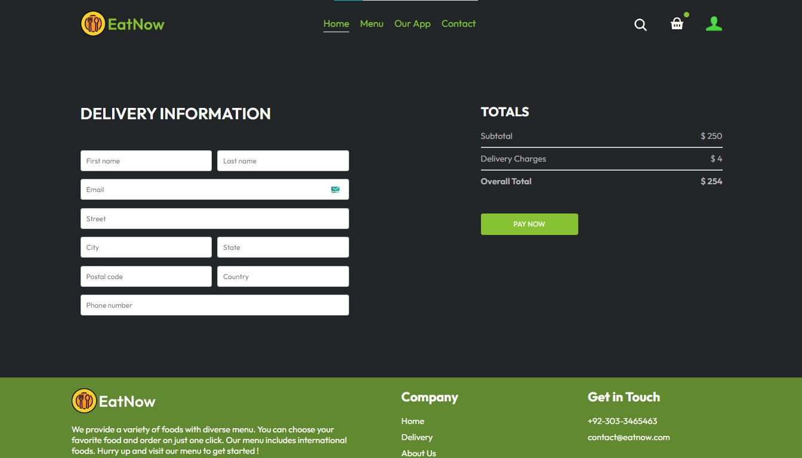
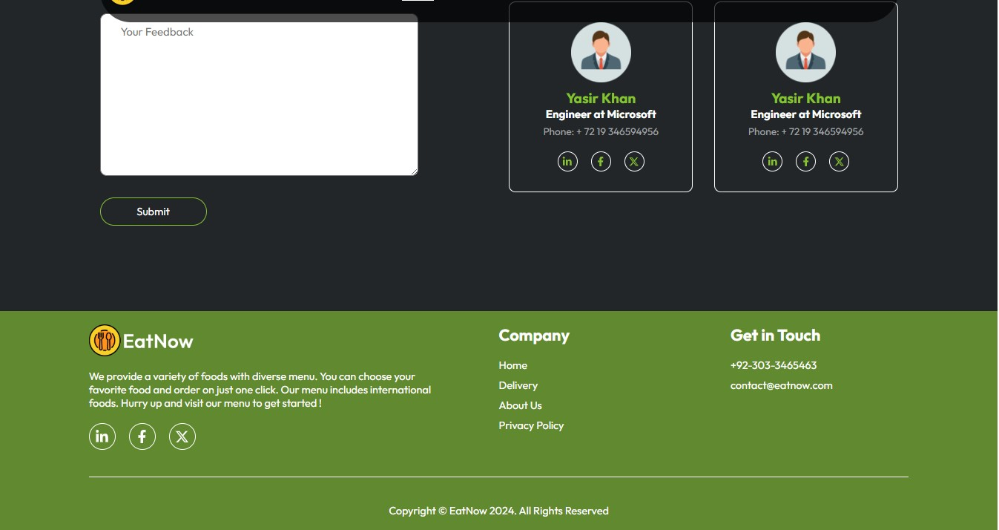
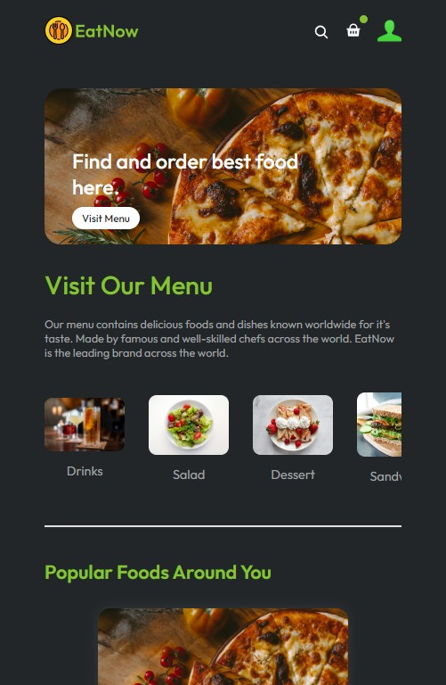
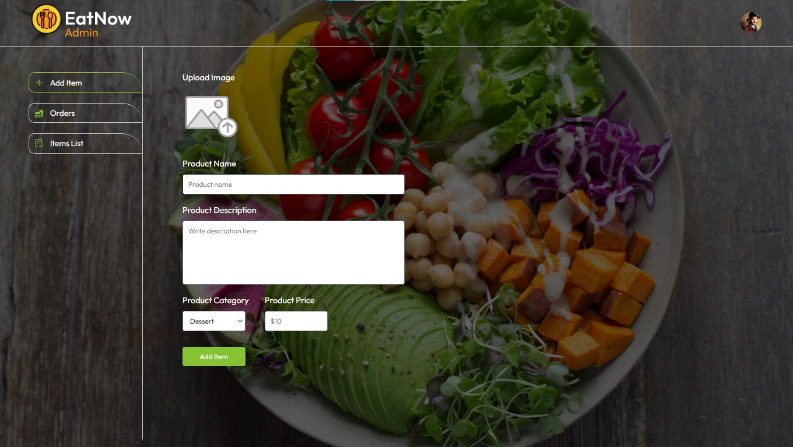

# Full Stack (MERN) Food Delivery Website

I Built a Full Stack (MERN) Food Delivery Website which is functional, responsive and secured using JavaScript, HTML and CSS, Git and
Github, Redux Toolkit and ECMAScript, ExpressJs, NodeJs, Mongoose, MongoDB and ReactJs. This is a full stack Food delivery website through which you can explore your food according to your will and can order food by adding food items to the card and proceed to the checkout and finally pay the bill by using a secured method called as Stripe. This website is available on my Github ID. I have also hosted
This website also includes a separate Admin Panel through which you can keep track of your food items in the website to properly add, change or remove the food items. This Panel is only for the owner of the website. All the data used in this website is fully dynamic and is stored in the MongoDB database (Atlas). The returned data is then stored in an advanced state management tool called as Redux Toolkit. Have a look this amazing website and don't forget to give it a star.

